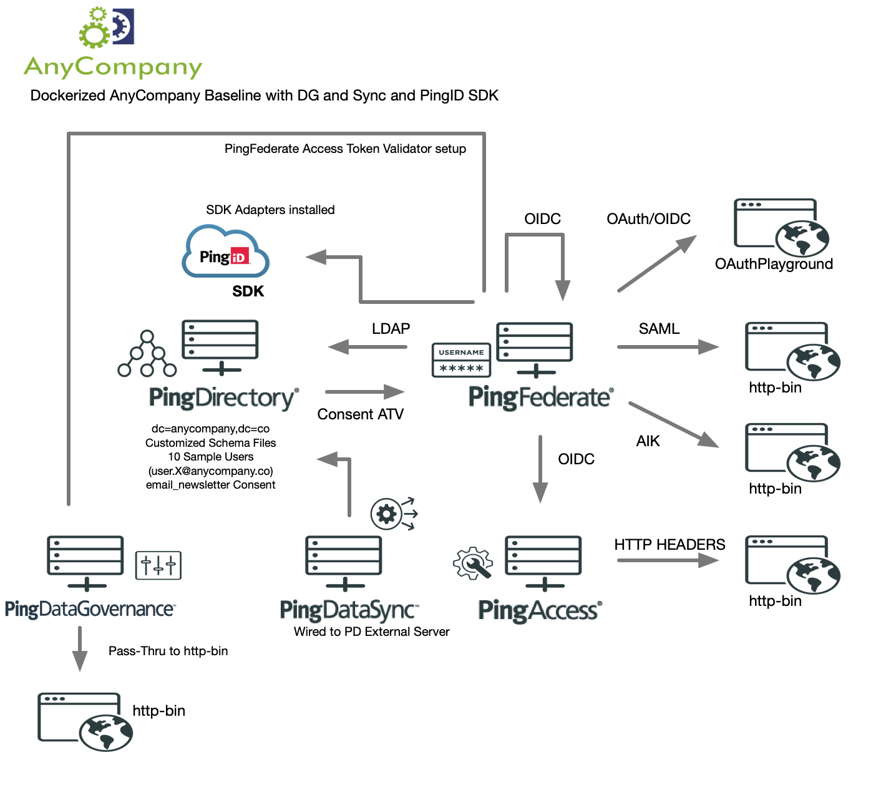

This is a sample starting point for a Ping platform as it relates to CIAM use cases.

NOTE: I assume you are following the steps outlined here for your Ping product licenses: https://pingidentity-devops.gitbook.io/devops/prod-license

Ingredients:
- Lab environment - could be your laptop, your own AWS instance, etc etc) of at least size xlarge(8GB RAM, 2 vCPU, 80GB disk) that will host Docker Engine, which will allow us to run Docker containers 
- Your own personal machine to access the Docker engine above

Pre-Requisites:

- Install Docker Engine (depending on your OS, look up instructions on how to install. I like to run Ubuntu on my Scalr VM - so I follow these instructions to install Docker: https://www.digitalocean.com/community/tutorials/how-to-install-and-use-docker-on-ubuntu-18-04) on your Docker Engine host
- Install Docker Compose (https://docs.docker.com/compose/install/) on your Docker Engine host

Step-By-Step:

1. Download the AnyCompany Baseline server profile: git clone https://github.com/pingidentity/pingidentity-solution-stacks.git
2. cd pingidentity-solution-stacks/
3. cd Solution-BaselineCustomer/
4. (OPTIONAL) - If you are making changes to my YAML file - Backup the existing docker-compose.yaml
-    cp docker-compose.yaml docker-compose.yaml.bak
5. Run docker-compose docker-compose up -d
6. On your personal machine, change your hosts file to point to the IP address of your Docker engine host and add the following entries. (And yes, I may change this for the future but just keeping it simple for now)
X.X.X.X pingfederate pingaccess pingdirectory pingdataconsole pingdirectory pingdatagovernance pingdatasync
7. And voila! You may now access the following administrative consoles:
- https://pingfederate:9999/pingfederate/app administrator/2FederateM0re!
   You'll notice PingID SDK Adapters are bundled in
- https://pingaccess:9000/login#/applications/applications administrator/2AccessM0re!
- http://pingdataconsole:8080/console/login 
   * PingDirectory Server: pingdirectory:636
       - Username: cn=dmanager
       - Password: 2DirectoryM0re!
   * PingDataGovernance Server: pingdatagovernance:636
       - Username: cn=dmanager
       - Password: 2DirectoryM0re!
   * PingDataSync Server: pingdatasync:636 (NOTE: PingDataSync has an external Server connection to PingDirectory but there are NO Sync Pipes pre-configured)
       - Username: cn=dmanager
       - Password: 2DataSyncM0re!
   * To connect PingDirectory to Apache Directory Studio, when you run docker container ls, look for the pingdirectory entry and its PORTS — NOTE the WEB and the LDAPS port
       - For example, if you see: 
          389/tcp, 689/tcp, 5005/tcp, 0.0.0.0:1447->443/tcp, 0.0.0.0:1640->636/tcp
       - You may connect to your local PD instance over port 1640, over LDAPS, using cn=dmanager/2DirectoryM0re!
       - Click on Always Trust Certificate for this Session

For user runtime ports, you can log into the console and grab the URLs, if you followed my instructions above, you can use the following URLs:
- SAML: https://pingfederate:9031/idp/startSSO.ping?PartnerSpId=https%3A%2F%2Fhttp-bin.org%2Fanything
   * user.0 / password 
   * Or you can go up to user.10 / password
- OIDC: https://pingfederate:9031/sp/startSSO.ping?PartnerIdpId=https%3A%2F%2Fpingfederate%3A9031
   * user.0 / password
   * Or you can go up to user.10 / password
- OAuthPlayground: https://pingfederate:9031/OAuthPlayground
   * AuthzCode, Implicit: user.0 / password up to user.10
   * ROPC: joe / 2Federate
   * Client Creds: client_credentials / 2Federate
- PingAccess App: https://pingaccess/anything
   * user.0 / password
   * Or you can go up to user.10 / password
- PingDataGovernance API: https://pingdatagovernance:2443/anything
   * Obtain a Token from PF via OAuthPlayground or make Postman calls if you wish
- For PingDirectory Consent API --> You may use either Basic or Bearer authentication. If you are using Bearer Authentication, use urn:pingdirectory:consent for Unprivileged consent calls and urn:pingdirectory:consent_admin for Privileged consent calls. A sample email_newsletter Consent Definition has been built for you
* To see consents for example: GET https://pingdirectory:<CHECK_DOCKER_PORT>/consent/v1/consents?definition=email_newsletter&subject=<user.0 through user.10> (See step 6D of this guide)
* To post consents for example: POST https://pingdirectory:<CHECK_DOCKER_PORT>/consent/v1/consents
* Check the PingDirectory Consent API documentation for full API call collection: https://apidocs.pingidentity.com/pingdirectory/consent/v1/api/guide/index.html

