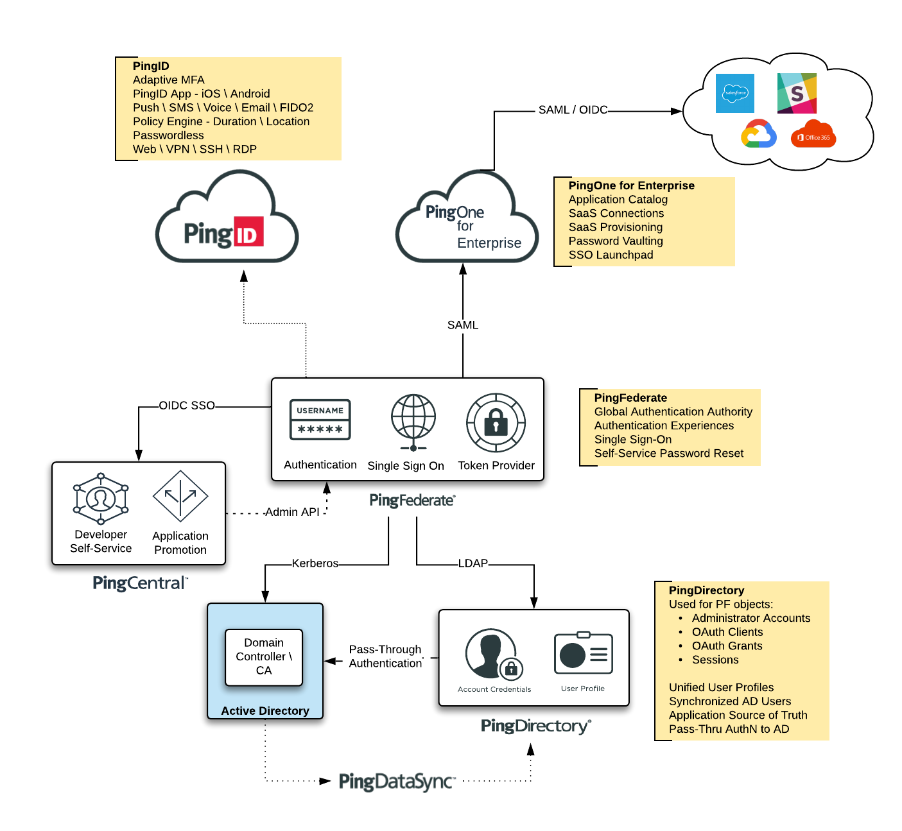

The Ping **Workforce360** Solution provides an Enterprise package for PingDirectory \ PingFederate \ PingID \ PingDataSync \ PingCentral

---
## Pre-Requisites
* ActiveDirectory Forest \ Domain Controller
  * Instructions on creating your own are here: [Build ActiveDirectory](./ActiveDirectory)
* PingID Tenant
  * Logon to PingOne Admin (https://admin.pingone.com)
  * Download PingID Properties file (Setup --> PingID --> Client Integrations)

## Deployment
This repo contains 2 configuration sets for deployment:
* [Docker Compose](deployment/Compose)
* [Kubernetes](deployment/K8s)

## Deployment Configuration

The bulk of the configuration is performed by a Postman API Collection:  
https://documenter.getpostman.com/view/1239082/SzS8tkns

**Note:** The collection has a set of default variables defined - to override them, place them in the `postman_vars.json` file.

**Collection Defaults**
| Variable | Description | Default |
| -------- | ----------- | ------- |
| `pfAdminURL` | PingFed Administration URL | https://pingfederate:9999 |
| `pdAdminUrl` | PingDir Administration URL | https://pingdirectory:443 |
| `pfAdmin` | PingFed API Admin Account | `api-admin` |
| `pfAdminPwd` | PingFed API Admin Password| {{globalPwd}} |
| `pdAdmin` | PingFed Admin Account | `cn=dmanager` |
| `pdAdminPwd` | PingDir Admin Password| {{globalPwd}} |
| `pdsAdmin` | PingDataSync Admin Account | `cn=administrator` |
| `pdsAdminPwd`  | PingDataSync Admin Password | {{globalPwd}} |
| `oauthSecret` | PingLogon Client Secret | {{globalPwd}} |
| `globalPwd` | Global Password | 2FederateM0re |
| `adDsServiceAccount` | PingFed AD Service Account | `pingfederate` |
| `adServicePwd` | PingFed AD Service Password | P@ssword99 |

**Compose - `postman_vars.json`**  
**Kubernetes - `pingconfig-cm0-configmap.yaml`**
| Variable | Description | Customer Values |
| -------- | ----------- | ------- |
| `pfBaseURL` | PingFed Runtime URL | https://{{your PF public FQDN}}:9031 |
| `pingId` | PingID SDK Properties  | Your SDK Properties file |
| `adDcHost` | AD Domain Controller | Your AD Domain Controller |
| `adBaseDN` | AD Base DN | Your AD Base DN |
| `pingCentralHost` | PingCentral Host (CORS setting) | Your PingCentral Host |

## Post-Deployment Steps
It's not possible to fully automate the implementation of this Solution. There are additional steps needed to be performed manually after things are running:

---
### Active Directory
This Profile is configured to use an Active Directory instance that has been pre-built and hosted Ping's Scalr \ AWS environment.  

If you'd like to use your own AD Forest, you will need to change the `Datastore` and `Password Credential Validator` to reflect your information.  

If you would like to **build** your own, you can use the Commands listed in the [ActiveDirectory](ActiveDirectory) section of this repo. 

---
### PingOne for Enterprise
In order to connect this PF instance to PingOne for Enterprise, you will need a P14E tenant. This process is somewhat automated through a Wizard, but cannot be automated in this Solution Profile.

In PF, go to `System --> Connect to PingOne for Enterprise` and select the `Sign on to PingOne to get your activation key` link (https://admin.pingone.com/web-portal/cas/config/idpng/pingFedActivate).  

Logon to PingOne for Enterprise and copy the Activation Key that should be presented. This key should be pasted into PF to begin the integration process.

**Notes:**
* When prompted to for a Directory Server, Select `Yes` and press the `Begin` button to connect the one that is created as part of this Solution
* Uncheck the `Outbound Provisioning` checkbox if you don't want to configure this.
* For the Extended Properties -- type `Basic` or `Passwordless` (depending on what journey you want a User Authentication to take)
* Use the `Default Policy Contract` to Map values into the Connection

---
### Enable LDAPS to PingDirectory
This Solution leverages **unsecured** LDAP between PingFederate and PingDirectory as it launches.  

To enabled LDAPS, follow these steps:

**Command Line**
1. Export the PingDirectory certificate
* Compose -- 
  * `docker-compose exec pingdirectory /opt/out/instance/bin/manage-certificates export-certificate --keystore /opt/out/instance/config/keystore --keystore-password-file /opt/out/instance/config/keystore.pin --alias server-cert --output-file server-cert.crt --output-format PEM`
* Kubernetes -- 
  * Connect to the Service -- `kubectl exec -it service/pingdirectory /bin/sh`
  * Execute this command -- `/opt/out/instance/bin/manage-certificates export-certificate --keystore /opt/out/instance/config/keystore --keystore-password-file /opt/out/instance/config/keystore.pin --alias server-cert --output-file server-cert.crt --output-format PEM`
1. Copy the certificate from the PingDirectory container
* Compose --
  * Get the Container names -- `docker container ls` - retrieve the Container IDs for PingDirectory and PingFederate
  * `docker cp {{pingdirectoryId}}:/opt/server-cert.crt ./server-cert.crt`
* Kubernetes -- 
  * Get the Container names -- `kubectl get pods` - retrieve the Container IDs for PingDirectory and PingFederate
  * `kubectl cp {{pingdirectoryId}}:/opt/server-cert.crt ./server-cert.crt`
  
**PingFederate Admin Console**
1. Import the PingDirectory certificate into PingFederate
* Open the Trusted CA store
  * `Security` --> `Trusted CAs`
* Import the `server-cert.crt` file

1. Edit the PingDirectory DataStore
* `System` --> `External Systems -- DataStores` --> `PingDirectory` --> `LDAP Configuration`
* Check the `Use LDAPS` box
* Test the Connection

**Disable LDAP on PingDirectory**
* Compose -- 
  * `docker-compose exec pingdirectory /opt/out/instance/bin/dsconfig set-connection-handler-prop --handler-name "LDAP Connection Handler" --set enabled:false --no-prompt`
* Kubernetes -- 
  * `kubectl exec service/pingdirectory /opt/out/instance/bin/dsconfig set-connection-handler-prop --handler-name "LDAP Connection Handler" --set enabled:false --no-prompt`

---
### Administrator Consoles
* PingFederate -- https://{{PF_HOSTNAME}}:9999/pingfederate
* PingDirectory -- https://{{PD_HOSTNAME}}:8443/console
* PingDataSync -- https://{{PD_HOSTNAME}}:8443/console
* PingCentral -- https://{{PC_HOSTNAME}}:9022
* PingID -- https://admin.pingone.com

## Configuration

To access the Admin UI for PF go to:  
<https://{{PF_HOSTNAME}}:9999/pingfederate>

Credentials:  
`Administrator` / `2FederateM0re`

This configuration includes:

### Adapters
* HTML Form
* Identifier-First (Passwordless)
* Kerberos
* PingID

### Authentication Policy
Extended Property Selector
  * Basic (HTML Form --> PingID)
  * Kerberos (Kerberos --> PingID)
  * Passwordless (ID-First --> PingID)

The Authentication Experience is controlled by setting the `Extended Properties` on the Application.  

### Extended Properties
* `Basic` (Plain HTML Form --> PingID)
* `Kerberos` (Kerberos --> PingID)
* `Passwordless` (ID-First --> PingID)

### Applications
Two applications are pre-wired:

**SAML:**  
<https://${PF_BASE_URL}/idp/startSSO.ping?PartnerSpId=Dummy-SAML>

**OAuth \ OIDC:**   
Flows:
* AuthZ Code
* Implicit
* Refresh Tokens

`Issuer` == ${PF_BASE_URL}  

`client_id` == PingLogon  
`client_secret` == 2FederateM0re

**Client Credential**  
`client_id` == cc_secret_client  
`client_secret` == 2FederateM0re

**Introspect**  
`client_id` == PingIntrospect  
`client_secret` == 2FederateM0re

### Users
If you are using the AD Configuration in this repo, the following users can be used to test with:

**Active Directory**
* `pinguser1` / `2FederateM0re`  
* `pinguser2` / `2FederateM0re`

**PingDirectory**
* `user.[0-4]` / `2FederateM0re`

### **Windows Client - Integrated Authentication (Kerberos)**  
If you want to demo Kerberos:

* Point your Windows OS DNS Client to the Domain Controller IP Address
* Join the Windows client to your Domain
* Logon to the Windows Client with a Domain User
* Add your PingFed host to the Intranet Zone of IE 
  * (You can do this with Powershell -- [100-Configure-IntranetSites-in-IE.ps](ActiveDirectory/100-Configure-IntranetSites-in-IE.ps))
* If you want to use Edge -- Import the IE settings (Settings --> Import --> IE)
* Set your PF Connection --> Extended Properties to `Kerberos`
* If you see a pop-up -- you've missed a step in the configuration
* **Note:** Things look to be a little odd with untrusted certificates - you end up in a Kerb --> PingID loop, and PF doesn't pass you properly through the `resumePath`. 
   * Either trust the PF cert in the browser as an Exception, or add a proper cert to `SSL Certificates` in PingFed

## PingCentral
To access the Admin UI for PC go to:  
<https://{{PF_HOSTNAME}}:9022>

**Administrator**
* `administrator` / `2FederateM0re`

**Application Owner**
* `appowner.0` / `2FederateM0re`